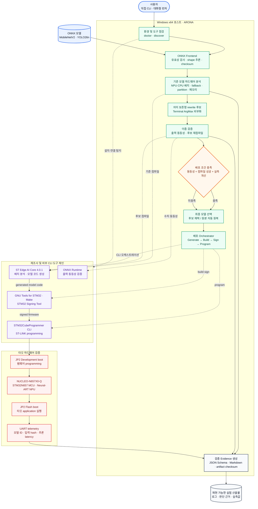

# ARONA

**Accelerator-aware Rewriting and Operator-compatible Neural Adaptation**

ARONA는 실제 제조사 컴파일러 결과를 바탕으로 ONNX 모델의 가속기 배치와 메모리 적합성을 분석하고, 펌웨어 생성부터 보드 프로그래밍 및 실기기 검증까지 하나의 CLI로 자동화하는 하드웨어 인지형 오픈소스 도구입니다. MVP에서는 NUCLEO-N657X0-Q를 대상으로 외부 테스트 모델인 MobileNetV2와 YOLO26n의 분석·배포를 검증했습니다.

> [!NOTE]
> ARONA는 특정 AI 모델을 내장하거나 배포하는 프로젝트가 아닙니다. MobileNetV2와 YOLO26n은 E2E 기능 검증을 위한 외부 입력이며, 모델 바이너리는 라이선스와 용량 문제로 Git에 포함하지 않습니다. 출처, 라이선스, SHA-256과 다운로드 절차는 [`models/manifest.json`](models/manifest.json)으로 관리합니다.

## MVP 범위

| 항목 | 현재 구현 및 검증 범위 |
| --- | --- |
| 타깃 보드 | STMicroelectronics NUCLEO-N657X0-Q |
| 가속기 | ST Neural-ART NPU |
| 검증 호스트 | Windows x64, PowerShell |
| 제조사 backend | ST Edge AI Core 4.0.1의 `stedgeai` |
| 외부 테스트 모델 | MobileNetV2 0.35 Food-101 128×128 ONNX QDQ, YOLO26n COCO-Person 256×256 ONNX QDQ Int8 |
| 입력 방식 | 카메라 없이 재현 가능한 fixed-input 실기기 추론 |
| 배포 흐름 | 환경 점검 → 컴파일러 분석 → 후보 검증 → generate → build/sign → program → UART validate |
| 결과물 | JSON·Markdown 분석 보고서, 컴파일러 및 배포 로그, 체크섬, UART 실측 증거 |

현재 MVP는 지원 보드와 backend를 의도적으로 하나로 제한해 “ONNX 입력부터 실제 보드 실행 증거까지”의 수직형 E2E 파이프라인을 완성하는 데 집중했습니다. 다른 보드와 모델을 자동으로 지원하거나 자동 경량화를 수행하는 기능은 향후 확장 목표입니다.

## 해결하려는 문제

서버나 GPU에서 정상 실행되는 ONNX 모델도 임베디드 NPU에서는 지원 연산자, 데이터 형식, shape, layout, 메모리 맵과 firmware 구성의 차이로 그대로 배포되지 않을 수 있습니다. 컴파일이 성공해도 일부 연산이 CPU로 fallback되거나 link, signing, programming, initialization 및 inference 단계에서 실패할 수 있습니다.

ARONA는 문서상의 연산자 지원표만 확인하지 않고 실제 제조사 컴파일러의 실행 계획과 보드 자원을 함께 분석합니다. 이를 통해 “컴파일러가 모델을 처리했는가”와 “생성된 firmware가 실제 보드에서 반복 추론되는가”를 구분하고, 실패 지점과 판단 근거를 재현 가능한 실행 기록으로 남깁니다.

## 핵심 기능

### 환경과 보드 도구 점검

`arona doctor`와 `arona discover`는 ST Edge AI Core, STM32CubeProgrammer CLI, NUCLEO external loader, Make, Arm GCC, objcopy, STM32 Signing Tool 및 ST-LINK 가상 COM 포트를 확인합니다. COM 포트 번호는 연결 환경마다 달라질 수 있으므로 자동 탐지 결과를 확인하거나 `--serial-port COMx`로 직접 지정합니다.

### 실제 컴파일러 기반 하드웨어 적합성 분석

`stedgeai analyze` 결과에서 컴파일러 epoch, 순수 하드웨어·hybrid·순수 소프트웨어 배치, fallback 연산자, graph partition, NPU·CPU 전환 및 메모리 풀을 구조화합니다. 컴파일러가 선택한 주소와 크기는 NUCLEO-N657X0-Q의 실제 메모리 맵과 대조합니다.

컴파일러 epoch은 ST Edge AI Core가 모델을 분할한 실행 단위이며 학습 epoch과는 다른 개념입니다.

### 안전한 rewrite 승인과 자동 원복

현재 구현된 rewrite는 모델 끝의 표준 ONNX ArgMax를 host 후처리로 외부화하는 terminal ArgMax 변환입니다. 후보가 만들어지면 ONNX Runtime 출력 동등성과 기준·후보 컴파일러 결과를 모두 확인하며, 조건을 만족하지 않으면 원본 모델로 자동 원복합니다.

두 MVP 테스트 모델의 원본 그래프에는 terminal ArgMax 적용 조건이 없어 실기기 E2E에서는 rewrite가 채택되지 않았습니다. 현재 실증 범위는 경량화 성과가 아니라 컴파일러 기반 적합성 분석, 불필요한 변환을 거부하는 안전한 선택과 자동 배포입니다.

### STM32N6 배포 자동화

`arona optimize --deploy`는 공식 STM32N6 application의 runtime 확인, UART telemetry 계측, application 설정, fixed-input 적용, model code generation, firmware build와 signing, ST-LINK programming 및 UART validation을 순서대로 실행합니다. Programming 이후에는 JP2를 Flash boot로 전환할 때까지 CLI가 멈추고 사용자의 확인을 기다립니다.

### 재현 가능한 결과 보고

실행 명령, 도구 버전, 모델 체크섬, 컴파일러 로그, 배치 결과, 메모리 적합성, rewrite 이력, firmware 체크섬, programming 결과와 UART 측정값을 versioned JSON Schema 및 Markdown으로 저장합니다.

## 시스템 구성



제조사 종속 로직은 공통 `BackendAdapter` 뒤에 분리하고, ONNX frontend, 최적화 검증, CLI 및 결과 보고 계층은 다른 backend에서도 재사용할 수 있도록 구성했습니다.

## NUCLEO-N657X0-Q 실측 결과

2026년 8월 25일 Windows x64 터미널에서 두 외부 테스트 모델을 처음부터 다시 배포하는 one-shot E2E 검증을 수행했습니다.

| 외부 테스트 모델 | 컴파일러 배치 | UART 반복 검증 | 순수 모델 추론 시간 |
| --- | --- | --- | --- |
| MobileNetV2 0.35 Food-101 128×128 QDQ | 순수 HW 54, hybrid 0, 순수 SW 1 / 총 55 epoch | 1,023/1,023 성공 | 2~3 ms, 평균 2.641 ms |
| YOLO26n COCO-Person 256×256 QDQ Int8 | 순수 HW 146, hybrid 16, 순수 SW 14 / 총 176 epoch | 465/465 성공 | 20~21 ms, 평균 20.944 ms |

YOLO26n의 순수 소프트웨어 epoch 14개는 Conv 8개, DequantizeLinear 1개, QuantizeLinear 2개, Softmax 2개, float Sub 1개이며 하나의 CPU partition과 한 번의 NPU·CPU 전환을 형성했습니다. 하드웨어가 관여하는 순수 HW와 hybrid epoch을 합치면 162/176, 약 92.0%이지만 이를 순수 NPU 배치율로 해석하지 않습니다.

위 결과는 fixed-input에서 생성된 firmware가 중단 없이 반복 추론되고 참고 latency 수준과 일관됨을 검증한 것입니다. 카메라 촬영, 전·후처리를 포함한 application 전체 처리량이나 Food-101·COCO-Person 정확도를 측정한 결과는 아닙니다. 자세한 제출 기준 설명은 [`1차 제출 결과보고서.md`](./1차%20제출%20결과보고서.md)를 참고하십시오.

## Windows x64 설치 및 실행 가이드

아래 절차는 Windows PowerShell과 NUCLEO-N657X0-Q를 기준으로, 새 개발 환경에서 MobileNetV2 fixed-input E2E를 실행하는 순서입니다. 명령은 저장소 루트에서 실행합니다.

### 0. 준비물과 외부 도구

필요한 하드웨어와 제조사 도구는 다음과 같습니다.

- NUCLEO-N657X0-Q와 데이터 통신이 가능한 USB 케이블
- ST Edge AI Core 4.0.1
- STM32CubeProgrammer 2.22.0과 NUCLEO-N657X0-Q external loader
- GNU Make, STM32 GNU Arm toolchain, `arm-none-eabi-objcopy`, STM32 Signing Tool
- Git과 `uv`

ARONA는 STM32CubeProgrammer와 build tool의 CLI를 직접 호출하므로 STM32CubeProgrammer 또는 STM32CubeIDE GUI에서 프로젝트를 열어 실행할 필요는 없습니다. 현재 자동 탐지는 일반 설치 경로의 STM32CubeProgrammer와 `C:\ST\STM32CubeIDE_2.2.0`, `2.0.0`, `1.19.0`에 포함된 CLI build tool을 확인하며, 별도 설치한 도구는 실행 파일이 있는 디렉터리를 `PATH`에 추가해야 합니다.

> [!TIP]
> Windows의 긴 경로 문제를 줄이려면 저장소를 `C:\work\ARONA`처럼 짧은 경로에 clone하는 것을 권장합니다.

### 1. Git과 uv 설치

관리자 권한이 가능한 PowerShell에서 Git과 uv를 설치하고 새 터미널을 엽니다.

```powershell
winget install --id Git.Git -e
winget install --id astral-sh.uv -e

git --version
uv --version
```

### 2. 저장소 clone

```powershell
New-Item -ItemType Directory -Path C:\work -Force | Out-Null
Set-Location C:\work

git -c core.longpaths=true clone `
  https://github.com/eodudrepublic/Accelerator-aware-Rewriting-and-Operator-compatible-Neural-Adaptation.git `
  ARONA

Set-Location .\ARONA
```

이미 clone한 저장소에서 vendor dependency의 긴 경로 오류가 발생하면 다음 설정도 사용할 수 있습니다.

```powershell
git config --global core.longpaths true
```

### 3. Python 환경과 ARONA 설치

`uv`가 `.python-version`에 맞는 Python 3.11과 잠금된 dependency를 준비합니다.

```powershell
uv sync --frozen
uv run arona --help
```

직접 `arona` 명령을 사용하려면 현재 PowerShell에서 가상환경을 활성화합니다.

```powershell
Set-ExecutionPolicy -Scope Process Bypass
.\.venv\Scripts\Activate.ps1

arona --help
```

가상환경을 활성화하지 않는 경우 이후 명령의 `arona`를 `uv run arona`로 바꾸면 됩니다.

### 4. ST Edge AI Core 4.0.1 연결

ST Edge AI Core가 `C:\ST\STEdgeAI\4.0`에 설치된 경우 다음 스크립트가 실행 파일과 필요한 Python module을 확인하고 현재 터미널의 `ARONA_STEDGEAI_PATH`, `STEDGEAI_CORE_DIR`, `PATH`를 설정합니다.

```powershell
. .\scripts\use_stedgeai.ps1 -Version 4.0
stedgeai --version
```

정상 설치에서는 `ST Edge AI Core v4.0.1`이 출력되어야 합니다. 환경변수를 사용자 계정에 저장하려면 `-Persist`를 추가한 뒤 새 터미널을 여십시오.

```powershell
. .\scripts\use_stedgeai.ps1 -Version 4.0 -Persist
```

### 5. STM32 도구와 보드 연결 점검

보드를 USB로 연결하고 Windows가 생성한 ST-LINK 가상 COM 포트를 확인합니다. COM 번호는 PC와 연결 순서에 따라 달라지므로 예시의 `COM5`를 그대로 사용하지 마십시오.

```powershell
Get-CimInstance Win32_SerialPort |
  Select-Object DeviceID, Name, PNPDeviceID
```

확인한 포트로 ARONA 환경 점검을 실행합니다.

```powershell
$port = "COM5"  # 실제 확인한 COM 번호로 변경

arona discover
arona doctor --serial-port $port
```

`doctor`에서 다음 항목이 준비된 것으로 표시되어야 배포할 수 있습니다.

- ST Edge AI Core
- STM32CubeProgrammer
- NUCLEO external loader
- Make
- Arm GCC와 objcopy
- STM32 Signing Tool
- ST-LINK serial port

STM32CubeProgrammer CLI로 SWD 연결을 직접 확인하려면 JP2를 Development boot로 설정하고 보드 전원을 다시 연결한 뒤 다음 명령을 사용합니다.

```powershell
& "C:\Program Files\STMicroelectronics\STM32Cube\STM32CubeProgrammer\bin\STM32_Programmer_CLI.exe" `
  -c port=SWD mode=UR
```

### 6. 외부 MVP 테스트 모델 다운로드

다음 스크립트는 MobileNetV2와 YOLO26n을 `models\downloads`에 내려받고 `models/manifest.json`의 SHA-256과 비교합니다. 이 디렉터리는 Git에서 제외됩니다.

```powershell
powershell -ExecutionPolicy Bypass -File .\scripts\download_mvp_models.ps1
```

다운로드 결과를 확인합니다.

```powershell
Get-ChildItem .\models\downloads\*.onnx
```

### 7. 원본 ONNX의 ST Edge AI 분석 확인

다음 명령은 MobileNetV2 ONNX를 STM32N6 Neural-ART 대상으로 분석하고 원문 로그를 저장합니다. 이 단계는 target ONNX를 새로 생성하는 작업이 아니라 컴파일러의 배치 및 메모리 분석을 독립적으로 확인하는 선택 절차입니다.

```powershell
New-Item -ItemType Directory -Path .\outputs\compiler -Force | Out-Null

stedgeai analyze --target stm32n6 `
  --model "models\downloads\mobilenetv2_a035_128_food101_qdq.onnx" `
  --type onnx `
  --st-neural-art *> "outputs\compiler\mobilenetv2.log"
```

ARONA를 통해 같은 모델의 구조화된 분석 보고서를 생성하려면 다음을 실행합니다.

```powershell
arona optimize .\models\downloads\mobilenetv2_a035_128_food101_qdq.onnx `
  --target stedgeai `
  --output-directory .\outputs\analysis
```

### 8. STM32N6 image classification application 준비

공식 ST application은 저장소에 포함하지 않고 `outputs\vendor` 아래에 clone합니다.

```powershell
New-Item -ItemType Directory -Path .\outputs\vendor -Force | Out-Null

git -c core.longpaths=true clone --recursive `
  https://github.com/STMicroelectronics/STM32N6-GettingStarted-ImageClassification.git `
  outputs\vendor\STM32N6-GettingStarted-ImageClassification
```

필수 경로를 확인합니다.

```powershell
$vendor = "outputs\vendor\STM32N6-GettingStarted-ImageClassification"
$app = "$vendor\Application\NUCLEO-N657X0-Q"

Test-Path $app
Test-Path "$vendor\Model"
Test-Path "$vendor\FSBL\ai_fsbl.hex"
```

다음 세 명령은 UART telemetry, MobileNetV2 application 설정과 카메라 없는 fixed-input 추론을 각각 적용합니다. 모두 같은 변경을 중복 적용하지 않도록 구현되어 있습니다.

```powershell
arona deployment instrument `
  --application image_classification `
  $app

arona deployment configure `
  --application image_classification `
  $app

arona deployment fixed-input `
  --application image_classification `
  $app
```

`arona optimize --deploy --fixed-input`도 위 준비 단계를 자동으로 수행하므로, 이 수동 명령은 각 단계를 따로 확인하거나 문제를 진단할 때 사용하면 됩니다.

### 9. 터미널 UI와 대화형 실행

Windows Terminal에서 유니코드와 색상을 명시적으로 활성화할 수 있습니다.

```powershell
$env:ARONA_UNICODE = "1"
$env:ARONA_COLOR = "1"
```

인자 없이 실행하면 화살표 키로 작업을 선택하는 대화형 런처가 열립니다.

```powershell
arona
```

자동화나 재현 기록이 필요하면 아래의 직접 CLI 방식을 사용하십시오.

### 10. MobileNetV2 one-shot 최적화 및 실기기 배포

Programming 전에 보드 전원을 분리하고 다음과 같이 설정한 뒤 USB 전원을 다시 연결합니다.

- JP1: position 1, `[1-2]`
- JP2: position 2, `[2-3]`, Development boot

다음 명령은 컴파일러 분석부터 application 준비, generate, build/sign, program 및 UART validation까지 실행합니다.

```powershell
$port = "COM5"  # 실제 연결된 ST-LINK 가상 COM 포트
$vendor = "outputs\vendor\STM32N6-GettingStarted-ImageClassification"
$app = "$vendor\Application\NUCLEO-N657X0-Q"
$model = "models\downloads\mobilenetv2_a035_128_food101_qdq.onnx"

arona optimize $model `
  --target stedgeai `
  --deploy `
  --deployment-application image_classification `
  --application-directory $app `
  --model-support-directory "$vendor\Model" `
  --fsbl "$vendor\FSBL\ai_fsbl.hex" `
  --serial-port $port `
  --fixed-input `
  --inference-count 5 `
  --capture-seconds 30 `
  --build-top build-arona-mobilenetv2 `
  --output-directory outputs\runs
```

Programming이 완료되면 CLI가 멈추고 Flash boot 전환을 안내합니다.

1. 보드 USB 전원을 분리합니다.
2. JP2를 position 1, `[1-2]`인 Flash boot로 옮깁니다. JP1은 position 1을 유지합니다.
3. USB 전원을 다시 연결하고 같은 COM 포트가 복구될 때까지 기다립니다.
4. CLI의 `Continue with UART inference validation?` 질문에 확인 입력을 합니다.

ARONA는 UART에서 모델 이름, fixed-input hash와 연속 추론 결과를 확인한 뒤 최종 JSON 및 Markdown 보고서를 생성합니다.

### 11. YOLO26n object detection 배포

YOLO26n을 검증하려면 공식 object detection application을 추가로 준비합니다.

```powershell
git -c core.longpaths=true clone --recursive `
  https://github.com/STMicroelectronics/STM32N6-GettingStarted-ObjectDetection.git `
  outputs\vendor\STM32N6-GettingStarted-ObjectDetection
```

보드를 Development boot로 설정하고 다음 명령을 실행합니다. Programming 이후의 Flash boot 전환은 MobileNetV2와 같습니다.

```powershell
$port = "COM5"  # 실제 연결된 ST-LINK 가상 COM 포트
$vendor = "outputs\vendor\STM32N6-GettingStarted-ObjectDetection"
$app = "$vendor\Application\NUCLEO-N657X0-Q"
$model = "models\downloads\yolo26n_256_coco_person_qdq_int8.onnx"

arona optimize $model `
  --target stedgeai `
  --deploy `
  --deployment-application object_detection `
  --application-directory $app `
  --model-support-directory "$vendor\Model" `
  --fsbl "$vendor\FSBL\ai_fsbl.hex" `
  --serial-port $port `
  --fixed-input `
  --inference-count 5 `
  --capture-seconds 30 `
  --build-top build-arona-yolo26n `
  --output-directory outputs\runs
```

## 주요 CLI 명령

```powershell
# 대화형 런처
arona

# 로컬 환경 점검
arona doctor --serial-port COM5
arona discover

# ONNX 및 실제 컴파일러 결과 분석
arona analyze model.onnx --compiler-log outputs\compiler\model.log

# live compiler를 이용한 최적화 판단
arona optimize model.onnx --target stedgeai

# 전체 배포 흐름
arona optimize model.onnx --target stedgeai --deploy `
  --application-directory <application-path> `
  --model-support-directory <model-support-path> `
  --fsbl <fsbl-path> `
  --serial-port COMx `
  --fixed-input

# 공개 JSON Schema 재생성
arona schema export
```

전체 옵션은 각 명령의 `--help`에서 확인할 수 있습니다.

```powershell
arona optimize --help
arona deployment --help
```

## 실행 산출물

각 optimize 실행은 `--output-directory` 아래에 시간 기반 run 디렉터리를 생성합니다.

```text
outputs/runs/<run-id>/
├── original-analysis.json
├── optimized-analysis.json       # 후보 분석이 수행된 경우
├── optimized-model.onnx          # rewrite 후보가 생성된 경우
├── rewrite-history.json          # rewrite 판단이 존재하는 경우
├── postprocess.json              # host 후처리 계약이 존재하는 경우
├── run-report.json
├── deployment-analysis.json      # --deploy 실행 시
├── compiler/
├── deployment/
│   ├── prepare/
│   ├── generate/
│   ├── build/
│   ├── program/
│   ├── validate/
│   └── deployment-result.json
└── report.md
```

모델과 vendor build output은 Git에 포함하지 않으며, 결과 공유 시에도 각 파일의 라이선스를 먼저 확인해야 합니다.

## 품질 검사

```powershell
uv run ruff format --check .
uv run ruff check .
uv run mypy src
uv run pytest --cov=arona --cov-report=term
```

2026년 8월 25일 현재 자동 검증 결과는 `70 passed, 1 skipped`, 분기 측정을 포함한 전체 코드 커버리지 81%입니다. 제외된 1개 테스트는 실물 보드를 요구하는 hardware test입니다.

## 현재 한계와 향후 방향

- 현재 정식 target은 NUCLEO-N657X0-Q, backend는 `stedgeai`로 제한됩니다.
- MobileNetV2와 YOLO26n은 제품 내장 모델이 아니라 MVP E2E 검증용 외부 입력입니다.
- 구현된 graph rewrite는 terminal ArgMax 한 종류이며, 두 MVP 원본 모델에서는 적용 조건이 성립하지 않았습니다.
- JP2 Development/Flash boot 전환과 USB 재연결은 사용자가 물리적으로 수행해야 합니다.
- ST Edge AI Core와 STM32 programmer/build toolchain은 사용자가 별도로 설치해야 합니다.

최종 제출까지 model manifest와 application 설정을 일반화하고 더 다양한 분류·검출 모델, board profile과 제조사 backend를 연결할 계획입니다. 장기적으로는 정확도 손실, latency, RAM, Flash 및 전력 조건을 입력받아 양자화, pruning, channel 축소와 연산 블록 치환 후보를 생성하고, 실제 컴파일러와 보드 측정으로 가장 적합한 모델을 자동 선택하는 하드웨어 인지형 경량화 기능을 목표로 합니다.

## 문서

- [MVP 시연 절차](docs/demo.md)
- [Windows E2E 설치·검증 기록](docs/windows-e2e-setup-validation.md)
- [NUCLEO-N657X0-Q 연결 및 복구 매뉴얼](docs/nucleo-n657x0-q-agent-manual.md)
- [ST Edge AI backend](docs/backends/stedgeai.md)
- [실행 결과 JSON 계약](docs/contracts/backend-cli.md)
- [개발 환경 및 품질 검사](docs/development.md)
- [의존성 및 라이선스](docs/dependencies.md)

## 라이선스

ARONA 소스코드는 [MIT License](LICENSE)를 따릅니다. 외부 테스트 모델과 ST 도구·application에는 각각의 별도 라이선스가 적용되며 ARONA의 MIT 라이선스에 포함되지 않습니다.
