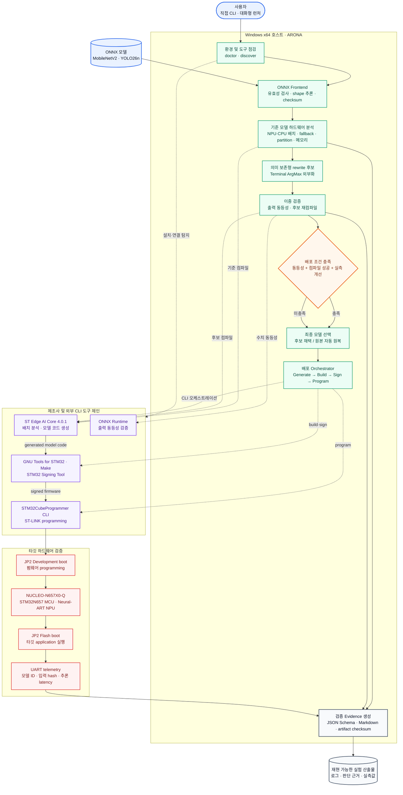

# 1차 제출 결과보고서

팀명: Shittim Chest

팀 인원: 2명

참가부문: 학생

과제유형: 자유과제

출품 대회: 2026 오픈소스 개발자대회

작성 기준일: 2026년 8월 25일

## 프로젝트 개요

### 프로젝트명

ARONA: Accelerator-aware Rewriting and Operator-compatible Neural Adaptation

### 프로젝트 등록 URL

[https://github.com/eodudrepublic/Accelerator-aware-Rewriting-and-Operator-compatible-Neural-Adaptation](https://github.com/eodudrepublic/Accelerator-aware-Rewriting-and-Operator-compatible-Neural-Adaptation)

### 시연 영상

시연 영상은 1차 제출 전 YouTube에 업로드한 뒤 URL을 추가할 예정입니다.

### 프로젝트 소개

ARONA는 실제 제조사 컴파일러 결과를 바탕으로 ONNX 모델의 가속기 배치와 메모리 적합성을 분석하고, 펌웨어 생성부터 보드 프로그래밍 및 실기기 검증까지 하나의 CLI로 자동화하는 하드웨어 인지형 오픈소스 도구입니다.
MVP에서는 NUCLEO-N657X0-Q를 대상으로 외부 테스트 모델인 MobileNetV2와 YOLO26n의 분석·배포를 검증해 재사용 가능한 end-to-end 파이프라인을 구현했습니다.

## 프로젝트 세부 내용

### 개발배경 및 목적

온디바이스 AI는 낮은 지연 시간, 네트워크 독립성과 개인정보 보호 측면에서 높은 가치를 갖습니다. 그러나 서버·GPU에서 동작하는 모델도 임베디드 NPU의 연산자, 데이터 타입, tensor 구조와 메모리 제약 때문에 그대로 실행되지 않을 수 있습니다. AI 컴파일러가 모델 변환에 성공해도 CPU fallback, 메모리 충돌, link·signing·보드 초기화 문제로 실제 배포는 실패할 수 있습니다.

기존 방식에서는 개발자가 모델 구조부터 컴파일러, runtime, 메모리 맵과 보드 부트 모드까지 개별적으로 확인하고 여러 제조사 도구를 반복 실행해야 했습니다. 이 과정은 최초 실패 원인을 빠르게 구분하기 어렵고, 모델이 변경될 때마다 시행착오를 반복해야 해 배포 경험이 개인에게 종속되는 문제가 있었습니다.

ARONA는 이 반복 작업을 구조화하고 자동화하기 위해 시작했습니다. 목적은 ONNX 형식 변환에 멈추지 않고, 실제 하드웨어 제약과 컴파일러 결과를 함께 해석해 안전한 모델을 선택하고 실기기 결과로 입증하는 것입니다. 최적화 후보가 의미적으로 안전하고 컴파일러 결과를 개선할 때만 채택하고, 그렇지 않으면 원본을 유지함으로써 실행 가능성과 재현성을 우선하는 하드웨어 인지형 최적화 방식을 제시합니다.

### 개발환경

- 타깃 하드웨어: STMicroelectronics NUCLEO-N657X0-Q 및 보드에 탑재된 ST Neural-ART NPU
- 부트 모드 전환: JP2 점퍼를 이용해 프로그래밍 시 Development boot, 실행 시 Flash boot로 전환
- 실기기 연결 및 검증: 온보드 ST-LINK를 이용한 펌웨어 프로그래밍, UART telemetry를 이용한 추론 결과 수집
- 검증 운영체제: Windows x64
- 개발 언어 및 패키지 환경: Python 3.11.15, uv 0.10.10, `uv.lock`
- 형상 관리: Git 2.53.0
- 모델 처리 및 검증: ONNX 1.22.0, ONNX Runtime 1.28.0, NumPy 2.4.6
- CLI 및 데이터 계약: Typer 0.27.0, prompt-toolkit 3.0.53, Pydantic 2.13.4
- 보드 통신: pyserial 3.5
- 제조사 컴파일·프로그래밍 도구: ST Edge AI Core 4.0.1, STM32CubeProgrammer CLI 2.22.0
- firmware 빌드 도구: GNU Tools for STM32 13.3.1, GNU Make 4.4.1, STM32 Signing Tool
- 품질 관리: pytest 9.1.1, pytest-cov 7.1.0, Ruff 0.16.0, mypy 2.3.0, pre-commit 4.6.1

### 시스템 구성 및 아키텍처

- 사용자 인터페이스 계층: 환경 점검, 모델 선택, 실행 계획 확인, 단계별 진행 상태와 결과 요약을 제공하는 직접 CLI 및 대화형 런처
- ONNX frontend 계층: 모델 유효성 검사, shape inference, node 식별, checksum 생성과 graph rewrite 입력 준비
- 하드웨어 backend 계층: 제조사 컴파일러 실행, NPU·CPU 배치와 fallback, partition, 메모리 풀 및 실패 단계 분석
- 최적화 검증 계층: 의미 보존형 rewrite 후보 생성, ONNX Runtime 출력 동등성 검사, 기준·후보 컴파일러 결과 비교와 자동 원복
- 보드 배포 계층: runtime 및 application 준비, model code generation, firmware build·signing, ST-LINK programming과 UART validation
- 결과 보고 계층: 실행 명령, 도구 버전, 판단 근거, artifact checksum과 실측 결과를 versioned JSON Schema 및 Markdown으로 저장

하드웨어와 제조사 도구에 종속되는 로직은 공통 `BackendAdapter` 뒤에 분리했습니다. MVP의 `stedgeai` backend는 ST Edge AI Core 원문에서 NPU·소프트웨어 실행 단위, fallback 연산자, graph partition, NPU·CPU 전환과 메모리 풀을 추출합니다. 메모리 분석기는 이를 NUCLEO-N657X0-Q의 실제 메모리 맵과 대조해 컴파일러가 선택한 주소와 크기가 유효한지 판정합니다. 이미지 분류와 객체 검출에 필요한 application 설정은 별도 모듈로 분리하여 두 task가 같은 분석·배포 계약을 공유하도록 구성했습니다.

핵심 데이터 흐름은 “ONNX 모델 입력 → 환경과 도구 탐지 → 기준 컴파일러 분석 → 가속기 배치와 메모리 진단 → rewrite 후보 검증 → 최종 모델 선택 → 모델 코드 생성과 펌웨어 빌드 → 보드 프로그래밍 → UART 추론 검증 → 통합 보고서 생성”으로 이어집니다. 새로운 board profile이나 backend를 추가하더라도 ONNX 분석, 실행 계약, 검증, CLI와 보고 계층을 재사용할 수 있도록 모델 처리 로직과 제조사 연동 로직을 분리한 것이 아키텍처의 핵심입니다.

### 프로젝트 주요 기능

ARONA의 핵심 차별점은 문서상의 연산자 지원표가 아니라 실제 ST Edge AI Core가 생성한 실행 계획을 분석 근거로 사용한다는 점입니다. NPU·CPU 배치, software fallback, graph partition과 전환, 메모리 요구량을 구조화해 “컴파일 가능”과 “보드 자원 안에 실제 배포 가능”을 구분하며, 단순한 성공 여부를 넘어 모델의 어느 구간에 최적화 여지가 남았는지를 설명합니다.

변환 안전성은 의미 보존형 rewrite, ONNX Runtime 출력 동등성, 기준·후보 컴파일러 비교를 연결한 승인 게이트로 보장합니다. 조건을 모두 만족한 후보만 채택하고 그렇지 않으면 원본을 유지합니다. 두 MVP 타깃 모델은 terminal ArgMax rewrite 조건에 해당하지 않아 원본을 선택했으며, 별도 테스트 variant에서 rewrite 적용과 출력 동등성을 검증했습니다. 이는 적용 건수를 늘리기 위해 불필요한 변환을 강제하지 않는 ARONA의 안전한 판단 정책을 보여줍니다.

2026년 8월 25일 NUCLEO-N657X0-Q에서 수행한 one-shot E2E 검증에서 MobileNetV2 0.35 Food-101 128×128 QDQ는 전체 55개 컴파일러 epoch(ST Edge AI Core가 모델을 분할한 실행 단위) 중 54개가 순수 하드웨어로 배치됐습니다. UART 반복 추론은 1,023회 중 1,023회 성공했고, 순수 모델 추론 시간은 2~3 ms, 평균 2.641 ms였습니다. YOLO26n COCO-Person 256×256 QDQ Int8은 176개 epoch 중 순수 하드웨어 146개, 혼합 16개, 순수 소프트웨어 14개로 배치되어 하드웨어 관여 비율 92.0%를 보였으며, 465회 추론을 모두 완료하고 평균 20.944 ms를 기록했습니다. 두 모델의 관측 성공률은 모두 100%였고, 실측 평균은 모델 출처의 STM32N6570-DK 참고값과 각각 1% 이내의 차이를 보였습니다. 다만 보드와 측정 조건이 다르므로 이를 최적화 전·후의 성능 비교로 해석하지 않았습니다.

특히 YOLO26n의 순수 소프트웨어 epoch 14개를 Conv 8개, DequantizeLinear 1개, QuantizeLinear 2개, Softmax 2개, float Sub 1개로 구분하고, 이들이 하나의 CPU partition과 한 번의 NPU·CPU 전환을 형성함을 확인했습니다. 이 결과는 하드웨어 관여 비율을 순수 NPU 배치율로 과장하지 않으면서도, QDQ 경계·후처리 연산·특정 Conv 구성으로 후속 개선 범위를 좁힐 수 있음을 보여줍니다. 이미지 분류와 객체 검출이라는 서로 다른 task가 같은 CLI와 배포 계약으로 실행된 점 역시 ARONA가 단일 모델용 스크립트가 아니라 재사용 가능한 배포 파이프라인임을 실증합니다.

개발은 실제 컴파일러 로그와 보드 메모리 맵을 기준으로 공통 실행 계약을 정의한 뒤, ONNX frontend·`stedgeai` backend·안전 변환 검증·실기기 배포 자동화를 단계적으로 결합하는 방식으로 진행했습니다. 각 실행은 모델 checksum, 컴파일러 배치, rewrite 이력, firmware checksum, programming 결과와 UART 실측값을 하나의 run report로 연결합니다. 자동 테스트 70개와 Ruff format·lint, mypy strict 검사를 통과했고, 전체 코드 커버리지 81%를 확보하여 분석·배포 기능의 회귀 검증 체계를 마련했습니다.

시연에서는 카메라·촬영 환경의 변수를 제거한 고정 이미지 입력으로 배포 안정성과 순수 모델 추론 시간을 확인했습니다. 따라서 위 수치는 응용 전체 처리량이나 Food-101·COCO-Person 정확도가 아니라 실기기 배포와 반복 추론의 성공 근거입니다. Windows x64 환경의 초기 설치부터 모델 준비, 보드 배포와 UART 검증까지의 상세 명령과 시연 순서는 GitHub 저장소의 [README 실행 가이드](https://github.com/eodudrepublic/Accelerator-aware-Rewriting-and-Operator-compatible-Neural-Adaptation#windows-x64-설치-및-실행-가이드)에 제공합니다.

### 기대효과 및 활용 분야

ARONA는 모델·컴파일러·펌웨어·실기기 결과를 하나의 검증 기록으로 연결함으로써 새 모델의 타깃 적합성 판단과 toolchain 변경 후 회귀 검사에 드는 반복 비용을 줄일 수 있습니다. 앞서 설명한 안전 선택과 실행 증거 보존은 개발 속도뿐 아니라 모델 승인·배포 결과의 신뢰성을 함께 높이는 기대효과로 이어집니다.

[Grand View Research](https://www.grandviewresearch.com/industry-analysis/edge-ai-software-market-report)는 전 세계 Edge AI 소프트웨어 시장이 2024년 19억 5천만 달러에서 2030년 89억 1천만 달러로 성장하고, 2025~2030년 연평균 성장률이 29.2%에 이를 것으로 전망했습니다. 영상·이미지 인식이 2024년 가장 큰 매출 비중을 차지한 데이터 유형이었다는 점은, ARONA가 MVP로 실증한 이미지 분류·객체 검출 배포 기술을 스마트 카메라, 산업 비전 검사, 사람 감지·안전 관리, 로봇·드론 분야에 우선 활용할 수 있음을 뒷받침합니다. 즉 ARONA는 2030년 약 89억 달러 규모로 성장이 전망되는 Edge AI 소프트웨어 생태계 안에서, 수요가 가장 큰 영상·이미지 영역의 타깃 배포 검증 도구로 활용 가능성을 갖습니다. 이 시장 수치는 ARONA의 직접 매출 예측이 아니라, 활용 분야가 속한 소프트웨어 시장의 규모와 성장성을 나타낸다는 범위로 해석했습니다.

초기 사용자는 신규 AI 보드의 모델 호환성을 입증해야 하는 반도체·보드 제조사, 다양한 고객 하드웨어에 모델을 납품하는 Edge AI 솔루션 기업, 출시 전 타깃 검증과 성능 회귀 검사가 필요한 모델 개발 조직입니다. 지원 보드가 늘어나면 제조사별 adapter, CI 기반 배포 검증, 보드·모델 조합 benchmark로 활용 범위를 확대할 수 있고, 교육·연구 환경에서는 ONNX 그래프와 실제 하드웨어 배치의 관계를 재현하는 실험 기반으로 활용할 수 있습니다.

### 기타

#### 혁신성·차별성 및 향후 발전 로드맵

ARONA의 차별성은 모델 변환과 하드웨어 배포 사이에 실제 컴파일러와 보드 결과를 다시 모델 선택에 반영하는 폐쇄형 검증을 구현한 데 있습니다. 제조사 도구를 대체하지 않고 그 앞뒤의 분석·판단·검증을 연결해 실행 결과를 재현 가능한 최적화 근거로 전환하며, 공통 backend 계약과 board profile을 통해 확장 가능한 오픈소스 구조를 제공합니다.

MVP에서는 NUCLEO-N657X0-Q와 두 비전 모델로 범위를 집중하여 수직형 E2E 배포와 반복 추론 검증에 성공했습니다. 제한된 일정과 장비 조건에서 현실적인 목표를 세우고 실측으로 완료를 입증한 것이 이번 단계의 핵심 성과입니다. 향후에는 지원 모델·보드·제조사 컴파일러를 확대하고, 특정 모델명이나 그래프 구조에 국한되지 않도록 양자화·pruning·연산 치환 후보를 실제 하드웨어 결과로 비교하여 최적 모델을 자동 선택하는 프로그램으로 발전시킬 계획입니다.

## SBOM(소프트웨어 자재명세서)

아래 표는 「붙임1 SBOM 작성 가이드」의 선별 기준에 따라 최종 Windows x64 검증 환경에서 직접 사용하는 오픈소스 중 GPL 계열, 핵심 기능 라이브러리와 핵심 빌드·실행 도구 순으로 10개를 선정해 작성했습니다. 출품작 자체인 ARONA, 전이 의존성, GitHub Actions, 별도로 설치하는 비오픈소스 ST 도구와 E2E 검증 입력으로만 사용하는 외부 AI 모델은 표에 포함하지 않았습니다. Python 직접 의존성 전체와 전이 의존성의 정확한 버전 및 파일 hash는 각각 `pyproject.toml`과 `uv.lock`에서 관리합니다.

| 번호 | 라이브러리명 | 버전 | 라이선스 | 공식 저장소 URL | 사용 목적 및 주요 기능 |
| --- | --- | --- | --- | --- | --- |
| 1 | GNU Make | 4.4.1_st_20231030-1220 | GPL-3.0-or-later | https://git.savannah.gnu.org/cgit/make.git/ | STM32 firmware build rule 실행 / 별도 설치한 CLI 실행 파일 호출 |
| 2 | GNU Compiler Collection (`arm-none-eabi-gcc`) | 13.3.1 (GNU Tools for STM32 13.3.rel1) | GPL-3.0-or-later | https://gcc.gnu.org/git/gcc.git | STM32N6 firmware 컴파일·링크 / 별도 설치한 CLI 실행 파일 호출 |
| 3 | ONNX | 1.22.0 | Apache-2.0 | https://github.com/onnx/onnx | 모델 로딩·유효성 검사·shape inference·graph rewrite / Python 라이브러리로 불러 씀 |
| 4 | ONNX Runtime | 1.28.0 | MIT | https://github.com/microsoft/onnxruntime | 원본·후보 모델의 출력 동등성 검증 / Python 라이브러리로 불러 씀 |
| 5 | NumPy | 2.4.6 | BSD-3-Clause | https://github.com/numpy/numpy | tensor·고정 입력 생성과 수치 비교 / Python 라이브러리로 불러 씀 |
| 6 | Pydantic | 2.13.4 | MIT | https://github.com/pydantic/pydantic | backend·pipeline·CLI 데이터 계약과 JSON Schema / Python 라이브러리로 불러 씀 |
| 7 | Typer | 0.27.0 | MIT | https://github.com/fastapi/typer | 명령행 인터페이스와 option 정의 / Python 라이브러리로 불러 씀 |
| 8 | prompt-toolkit | 3.0.53 | BSD-3-Clause | https://github.com/prompt-toolkit/python-prompt-toolkit | 화살표 키 선택·입력 자동완성·대화형 런처 / Python 라이브러리로 불러 씀 |
| 9 | pyserial | 3.5 | BSD-3-Clause | https://github.com/pyserial/pyserial | COM 포트 UART telemetry 수집 / Python 라이브러리로 불러 씀 |
| 10 | uv | 0.10.10 | MIT OR Apache-2.0 | https://github.com/astral-sh/uv | 의존성 설치·lockfile 기반 환경 재현·ARONA 실행 / 별도 설치한 CLI 실행 파일 호출 |
